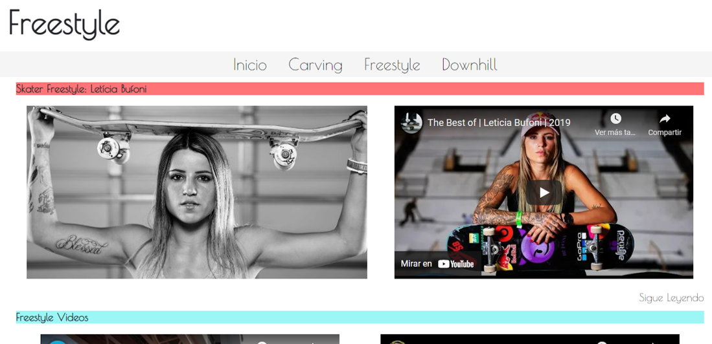

# Skate Move

Proyecto para CoderHouse, es una web que explica brevemente en que consisten algunas modalidades del skateboard.

## Descripción
Este repositorio es el proyecto final del proyecto de la academia CoderHouse. Este es una pagina web que explica brevemente algunas modalidades del skateboard.

Para la creación se utilizó HTML, CSS, SASS, Bootstrap y conocimientos básicos de SEO.

## Screenshots del Proyecto

Visualización del Index

Visualización de algunas sesiones

## Visualización del Proyecto

Usa este link para ingresar y visualizar el proyecto completo [https://felixmartinezcasadiego.github.io/SkateMove/](https://felixmartinezcasadiego.github.io/SkateMove/) 

## Licencia 
No posee licencia