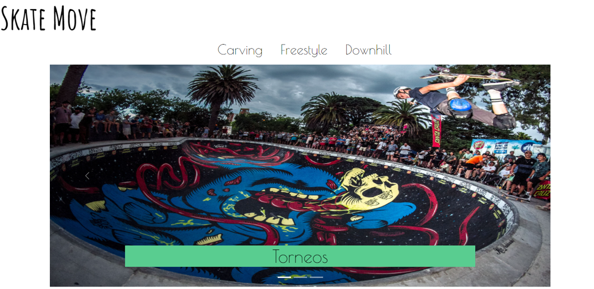

# Skate Move

Este repositorio es del proyecto final de la academia CoderHouse. Es una página web que explica brevemente algunas modalidades del skateboard.

## Descripción

Para la creación se utilizó HTML, CSS, SASS, Bootstrap y conocimientos básicos de SEO.

Se visualiza en esta página web la modalidad de FreeStyle, Downhill y carving. Explicando como es cada estilo, skater de referencia con pequeña biografía y estilo de patinetas para cada modalidad. Además de pequeñas noticias relevantes, sesión de torneos, videos de las modalidades y un documental de un referente importante del skateboard.

## Screenshots del Proyecto

#### Visualización Index

#### Visualización sesión FreeStyle

#### Visualización sesión Downhill

## Visualización del Proyecto

Usa este link para ingresar y visualizar el proyecto completo [https://felixmartinezcasadiego.github.io/SkateMove/](https://felixmartinezcasadiego.github.io/SkateMove/) 

## Licencia 
No posee licencia